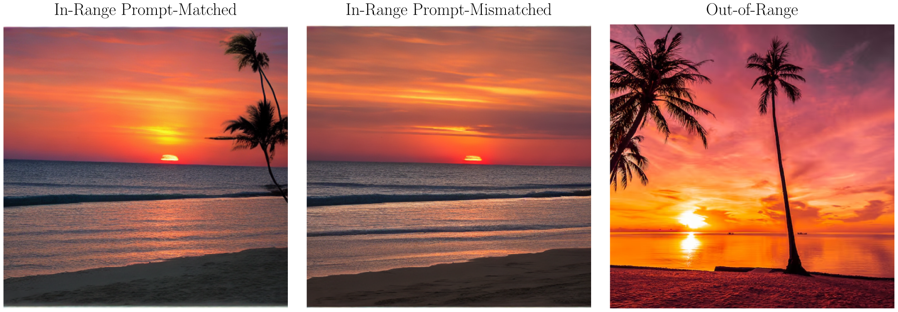

# Active Learning for Conditional Generative Compressed Sensing

This repository accompanies *Active Learning for Conditional Generative
Compressed Sensing*. The paper studies image recovery from subsampled Fourier
measurements using a prompt-conditioned generative model. The sampling prompt
$c_s$ determines the sampling law, while the recovery prompt $c_r$ defines
the class used for reconstruction. The target prompt is denoted by $c_*$
when the target belongs to a prompt-conditioned model class.

The code estimates empirical Christoffel functions for Stable Diffusion 1.5,
constructs Fourier sampling laws, and recovers images by latent optimization.
The main experiments compare four empirical Christoffel laws with uniform MCS
and inverse-square sampling. The repository also includes recovery-CFG
ablations, Christoffel convergence studies, and analysis notebooks.

## Setup

Use Python 3.11 or 3.12. Install the pinned dependencies in
[requirements.txt](requirements.txt) with a CUDA-capable PyTorch installation
if you intend to perform reconstruction:

```bash
python3.12 -m venv .venv
source .venv/bin/activate
pip install -r requirements.txt
```

Launchers use the active environment's Python interpreter and honor
`PYTHON_BIN`. Generating images, estimating Christoffel functions, and
reconstructing images requires the Stable Diffusion 1.5 weights. See
[THIRD_PARTY_NOTICES.md](THIRD_PARTY_NOTICES.md) for model licensing and
attribution. Analysis of the saved results does not require running the
diffusion model. PDF figures use Computer Modern through LaTeX and require
`amsmath`, `amssymb`, and Matplotlib's TeX dependencies.

## Repository Organization

<pre>
📦 ActiveConditionalGCS/
│
├── 📄 <a href="README.md">README.md</a>                         ← Project overview and experiment commands
├── 📄 <a href="requirements.txt">requirements.txt</a>                  ← Python dependencies
├── 📄 <a href="THIRD_PARTY_NOTICES.md">THIRD_PARTY_NOTICES.md</a>           ← Model, code, and image attribution
├── 📄 <a href="activeconditionalgcs.pdf">activeconditionalgcs.pdf</a>          ← Paper PDF
├── 📄 <a href="build_dataset.py">build_dataset.py</a>                  ← Build or validate target datasets
├── 📄 <a href="build_ktilde.py">build_ktilde.py</a>                   ← Estimate empirical Christoffel functions
├── 📄 <a href="run_ktilde_convergence.py">run_ktilde_convergence.py</a>         ← Run one convergence trial
├── 📄 <a href="run_conditioning_regression.py">run_conditioning_regression.py</a>      ← Run reconstruction suites
│
├── 📁 <a href="src/">src/</a>                              ← Shared reconstruction package
├── 📁 <a href="configs/weighted/">configs/weighted/</a>                 ← Main and CFG-ablation configurations
├── 📁 <a href="datasets/">datasets/</a>                         ← Fixed target images and metadata
├── 📁 <a href="ktilde/weighted/">ktilde/weighted/</a>                    ← Christoffel estimates and convergence trials
├── 📁 <a href="scripts/weighted/">scripts/weighted/</a>                   ← Experiment launchers
├── 📁 <a href="scripts/release/">scripts/release/</a>                    ← Data packaging and verified downloads
├── 📁 <a href="analyze_results/weighted/">analyze_results/weighted/</a>           ← Figure-reproduction notebooks
├── 📁 <a href="assets/">assets/</a>                           ← README target-image panel
└── 📁 <a href="results/weighted/">results/weighted/</a>                   ← Downloaded or locally generated results
    ├── 📁 <a href="results/weighted/prompt_matched/">prompt_matched/</a>
    ├── 📁 <a href="results/weighted/prompt_mismatched/">prompt_mismatched/</a>
    ├── 📁 <a href="results/weighted/out_of_range/">out_of_range/</a>
    ├── 📁 <a href="results/weighted/ablation/">ablation/</a>
    └── 📁 <a href="results/weighted/ktilde/">ktilde/</a>
</pre>

Folder guides describe the [source package](src/README.md),
[configurations](configs/README.md), [datasets](datasets/README.md),
[Christoffel estimates](ktilde/README.md), [launchers](scripts/README.md), and
[analysis](analyze_results/README.md).

## Experiments



| Experiment | Target |
| --- | --- |
| `prompt_matched` | SD1.5 image generated with $c_*=\texttt{"sunset beach"}$ |
| `prompt_mismatched` | SD1.5 image generated with $c_*=\texttt{"sunset over a sandy coast"}$ |
| `out_of_range` | Fixed external sunset photograph |

The external photograph is attributed to [Magnific](https://www.magnific.com/free-photo/sunset-time-tropical-beach-sea-with-coconut-palm-tree_3531881.htm).
The other targets were generated with SD1.5 and were not used to estimate
the sampling laws.

The sampling and recovery prompt family consists of `""`, `"daytime beach"`, `"sunset beach"`, and `"cat"`,
denoted by $c_{\mathrm{uc}}$, $c_{\mathrm{db}}$, $c_{\mathrm{sb}}$, and
$c_{\mathrm{ca}}$. The main experiments use six sampling laws, four recovery
prompts, ratios $m/n=0.01,0.02,0.03,0.04,0.05$, and five trials, giving 1,800
reconstructions. Recovery uses the weighted unitary Fourier operator and
2,000 Adam iterations. The learning rate is $0.1$ for the first 400 iterations,
then decreases by cosine decay to $0.001$. The empirical Christoffel laws use
$\zeta=1/2$ regularization.

The recovery-CFG ablation fixes the recovery prompt to `"sunset beach"` and
compares CFG 1, 3, 5, and 7.5 under the four Christoffel laws. It uses the same
ratios, five trials, and optimization settings. CFG 1 reuses 300 main-study
reconstructions. The other CFG values add 900 reconstructions.

## Reproduce the Figures

The [figure-reproduction data release](https://github.com/alexdelise/ActiveConditionalGCS/releases/tag/paper-results-v1)
contains the completed weighted experiments and Christoffel studies. The
[release guide](scripts/release/README.md) describes its contents and integrity
checks. Download and verify all required data from the repository root:

```bash
python scripts/release/download_results.py
```

Then open the [weighted analysis notebooks](analyze_results/weighted/README.md).
They reproduce sampling-ratio sweeps, recovered-image panels, optimization
traces, aggregate forest plots, and Christoffel figures from the saved data.
PDFs and summary tables are written to each experiment's own figures folder
under [results/weighted/](results/weighted/).

## Run Reconstructions

Reconstruction is expensive. A single reconstruction can take hours, and the
complete experimental study took approximately two months on the available
hardware. Use the saved data to reproduce figures without rerunning recovery.

Run one sampling law and recovery prompt across all five ratios and trials:

```bash
./scripts/weighted/run_main.sh prompt_matched k2 sunset_beach
./scripts/weighted/run_main.sh prompt_mismatched mcs sunset_beach
./scripts/weighted/run_main.sh out_of_range inverse_square sunset_beach
```

Run one recovery-CFG setting across all five ratios and trials:

```bash
./scripts/weighted/run_ablation.sh prompt_matched k2 3
```

Sampling laws are `k0`, `k1`, `k2`, `k4`, `mcs`, and `inverse_square`.
Recovery prompts are `unprompted`, `daytime_beach`, `sunset_beach`, and `cat`.
The ablation accepts the four Christoffel laws and CFG `1`, `3`, `5`, or `7.5`.
Append `--dry-run` to inspect a command without starting reconstruction.

If a command is interrupted, run it again. Completed reconstructions are
reused, and unfinished optimization resumes from its latest saved checkpoint.
The data release includes completed artifacts for figure reproduction, not
optimizer checkpoints for continuing those reconstructions.

## Reproducibility

Each reconstruction records its configuration, random seeds, dataset identity,
sampled frequencies, selected probabilities, metrics, and optimization trace.
Sampling seeds do not depend on the recovery prompt, so recovery conditions
use paired masks. The fixed targets, Christoffel estimates, and saved results
allow the notebooks to reproduce the reported figures without generating new
images or rerunning latent optimization.

## Citation

```bibtex
@article{delise2026active,
  title={Active Learning for Conditional Generative Compressed Sensing},
  author={DeLise, Alexander and Dexter, Nick},
  journal={arXiv preprint arXiv:2605.05435},
  year={2026}
}
```
